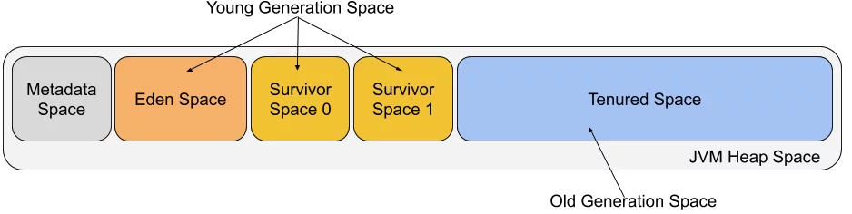

## 도대체 gc는 언제 발생하는가

### GC 란? (GarbageCollection)  
사용하지않는 필요하지않은 객체(쓰레기객체)를 메모리에서 해제하는 작업  
C와는 다르게 java는 메모리를 알고리즘을 통하여 관리하여 개발자가 메모리를 처리하기위한 로직을 만들 필요가 없음(해서도 안됨)  

### Runtime data area
 자바 애플리케이션을 실행할 때 사용되는 데이터들이 저장되는 메모리 공간  

- Heap  
- Method Area  
    - Run-Time Constant Pool  
- Java Virtual Machine Stacks  
- Native Method Stacks  
- PC Register  

GC가 발생하는 영역은 Heap영역  

#### Heap
인스턴스, 참조 자료형이 저장되는 shared메모리로 여러 쓰레드에서 공유하는 데이터들이 저장됨  

#### Non-Heap
- Method Area : 모든 JVM에서 공유  
클래스 정보, 메서드정보 등 저장  
  - Run-Time Constant Pool : 상수값, 실행시 변하는 필드참조정보(메서드데이터)
- Java Virtual Machine Stacks : 메서드가 수행될 때마다 스택 프레임을 생성하여 메서드 호출정보(프레임), 지역변수, 임시결과, 메서드 수행과 리턴 데이터 값이 저장되는 공간  
(실제 데이터를 갖고 있는 Heap 영역의 참조 값을 Stack 영역의 객체가 갖고 있다.)  
- Native Method Stacks : java가 아닌 다른언어로된(C) 실행할때 스택정보관리  
- PC Register : 현재 수행중인 JVM 명령어 주소를 저장하는 공간  

### GC의 원리
가비지콜렉터는 다음의 역할을 한다.  
- 메모리할당  
- 사용중인 메모리 인식  
- 사용하지않는 메모리인식  

#### 
  

 한 객체는 여러 다른 객체를 참조하고, 참조된 다른 객체들도 마찬가지로 또 다른 객체들을 참조할 수 있으므로 객체들은 참조 사슬을 이룬다. 이런 상황에서 유효한 참조 여부를 파악하려면 항상 유효한 최초의 참조가 있어야 하는데 이를 객체 참조의 root set이라고 한다.  
 참조 사슬과 무관한 객체들이 unreachable 객체로 GC 대상이다.

#### 자바의 메모리영역
  

  
- 마이너 GC : Young 영역에서 발생하는 GC  
- 메이저 GC : Old영역에서 발생하는 GC (Full GC)  

### GC 방식  
Heap 영역에 존재하는 객체들에 대해 접근 가능한지 확인한다.  
GC Root에서 부터 시작하여 참조값을 따라가며 접근 가능한 객체들에 Mark하는 과정을 진행한다.  
Mark 되지 않은 객체 즉, 접근할 수 없는 객체는 제거(Sweep) 대상이 되어 해당 객체들을 제거한다.  

#### Mark-Sweep-Compact
- Mark: 접근 가능한 객체에 Mark하여 표시  
- Sweep: Mark되지 않은 객체들을 제거하는 과정  
- Compact: Sweep 과정에 의해 삭제되면 메모리 단편화가 발생하는데, Compact를 통해 빈자리들을 채워줌  

#### STOP-THE-WORLD
GC를 실행하기 위해 JVM이 모든 애플리케이션 실행을 멈추는 것  
stop-the-world가 발생하면 GC를 실행하는 쓰레드를 제외한 나머지 쓰레드는 모두 작업을 멈춘다.  

#### GC 종류

- Serial GC (싱글 스레드)  
- Parallel GC (멀티 쓰레드)  
- Concurrent Mark Sweep GC (CMS)  
: Java 9부터 deprecated 되었고, Java 14에서 drop 되었다.
: STW 를 줄임  
: 컴팩션단계를 거치지 않음  
    - initial mark : 매우짧은 대기시간으로 살아있는 객체를 찾음(STW) 
    - concurrent mark : 서버수행과 동시에 살아있는 객체에 표시  
    - remark : 변경된 객체에 대해 다시 표기(STW)  
    - concurrent sweep : 표시되어있는 쓰레기를 정리  

- Garbage First GC (G1GC)  
바둑판으로 각 영역(region)에 객체를 할당, 해당 영역이 꽉차면 GC  
멀티스레드 GC  
메이저 GC : Init Mark(STW) -> Root Region Scanning -> Concurrent Mark -> Remark(STW) -> Cleaning(STW) -> Copy  

- ZGC  
java11 공개  
STW로 인한 성능저하를 개선하기 위한 목적을 가지고 Oracle에서 개발  
https://d2.naver.com/helloworld/0128759  

#### default GC
Java8 : ParallelGC  
Java9 ~ : G1 GC
~~~
java -XX:+PrintCommandLineFlags -version
~~~
java17 : `-XX:+UseG1GC`

### 강제로 GC 발생시키기
`System.gc()` : **사용하지말자**

### 참고  
https://devocean.sk.com/blog/techBoardDetail.do?ID=165630  
https://memostack.tistory.com/229  
https://medium.com/@dontsu/%EC%99%9C-heap-%EC%98%81%EC%97%AD%EC%9D%B4-%ED%95%84%EC%9A%94%ED%95%9C%EA%B1%B8%EA%B9%8C-9097c1ec5927
https://d2.naver.com/helloworld/329631  